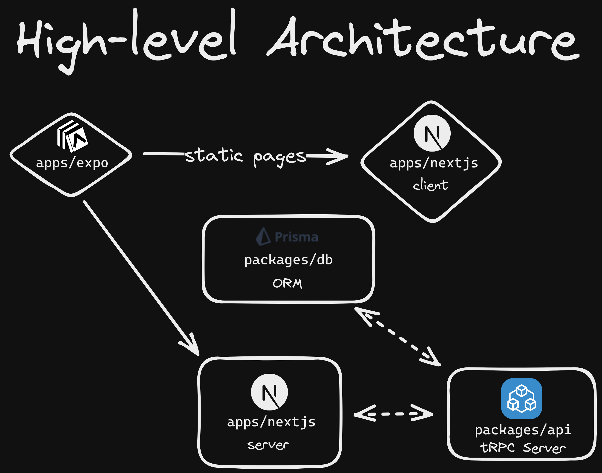

# SchoolConnect

This is the main repository and source code for the SchoolConnect application. It contains the backend, frontend, website, and database of the application. If you are looking for the documentation, check out our [support tracker](https://github.com/Yash-Singh1/schoolconnect-support-tracker).

## Architecture

The architecture of how the packages interact with each other is as shown in the following diagram:

For more information on the specifics of the packages, check out the READMEs in their packages.

## Getting Started

To get started running this application, check out the [instructions](./INSTRUCTIONS.md).
